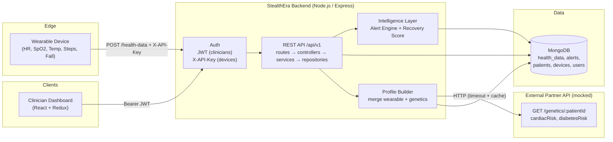

# System Architecture 

## Overview

StealthEra RPM ingests physiological packets from wearable devices, validates and
stores them, evaluates health-alert rules, and exposes clinician-facing APIs that
merge wearable data with an external genetic-risk partner. A React dashboard consumes
those APIs.

## Diagram

## Request Flow

1. **Ingestion** — device sends `POST /api/v1/health-data` with `X-API-Key`. The
   payload is validated (structure + physiological bounds), deduplicated on
   `(deviceId, timestamp)`, stored, then run through the alert engine.
2. **Read** — the dashboard authenticates a clinician (`POST /api/v1/auth/login`),
   receives a JWT, and reads `/patients/:id/latest|history|summary` and
   `/patient-profile/:id`.
3. **Integration** — the profile builder calls the genetics partner API over HTTP
   (configurable base URL, timeout, in-memory cache) and merges the result with the
   wearable summary. If the partner is unavailable the response degrades gracefully.

## Layering

`routes` (HTTP wiring) → `controllers` (request/response) → `services` (business
logic: ingestion, alerts, recovery, profile merge) → `repositories` (data access) →
`models` (Mongoose schemas). Cross-cutting concerns live in `middleware`
(auth, validation, errors, logging) and `config` (env + physiological constants).

## Authentication

- **Devices** authenticate with a static `X-API-Key` (fast, stateless, rotatable per
  fleet). Only the ingestion endpoint uses it.
- **Clinicians** authenticate with email/password and receive a short-lived JWT used
  as a bearer token for all patient/profile reads.
- Both are toggled by `AUTH_ENABLED` for local exploration.
